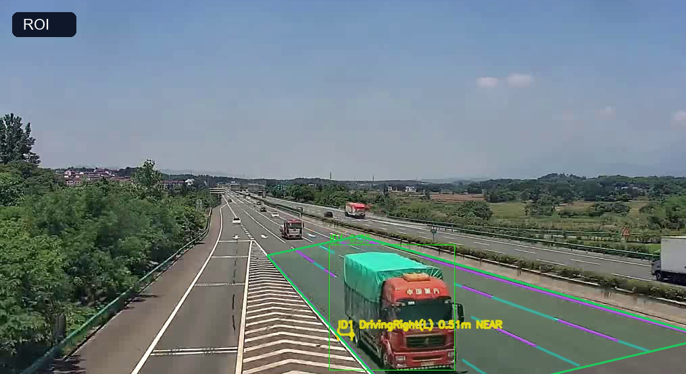
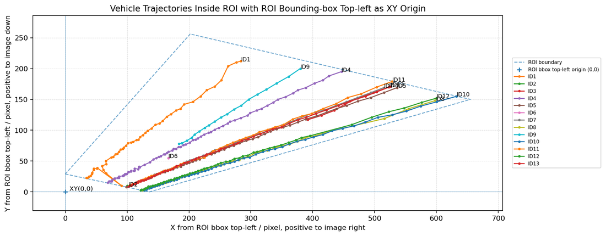
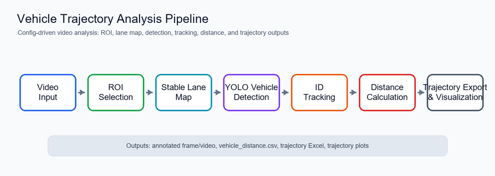

# Vehicle Trajectory Analysis

基于道路监控视频的车辆检测与轨迹分析项目。项目使用 YOLO 完成车辆检测与分割，结合手动 ROI 和稳定车道线地图，输出车辆逐帧轨迹、车道线距离、ROI 坐标系下的 Excel 表格和轨迹可视化结果。

这个仓库整理为 GitHub 展示版本，重点体现一个完整 Python 视觉工程的结构、配置管理、数据处理链路和结果导出能力。

## 项目背景

道路监控视频中，车辆会受到摄像机视角、车道线遮挡、远处小目标和 ROI 范围变化的影响。项目将任务拆成几个可复用步骤：

1. 读取视频信息并截取参考帧。
2. 通过 ROI 配置限定道路区域。
3. 在 ROI 内生成稳定车道线地图。
4. 使用 YOLO 检测车辆并记录逐帧位置。
5. 将车辆轨迹转换到 ROI 相对坐标系。
6. 导出 Excel、CSV、轨迹图和可选叠加视频。

## 功能

- 车辆检测：基于 Ultralytics YOLO 的车辆检测与分割。
- ROI 管理：支持交互式选取 ROI，并生成 ROI mask 验证图。
- 车道线建模：从多帧采样结果中聚合稳定车道边界。
- 轨迹记录：输出车辆 ID、类别、帧号、位置、车道线距离等逐帧 CSV。
- Excel 导出：输出 ROI 相对坐标系下的车辆轨迹 Excel。
- 轨迹图绘制：输出总览轨迹图、单车轨迹图和可选轨迹叠加视频。
- YAML 配置：通过 `config.yaml` 管理视频路径、ROI、检测阈值和输出路径。

## 项目结构

```text
.
|-- main.py
|-- config.yaml
|-- requirements.txt
|-- README.md
|-- configs/
|   |-- roi_config.json
|-- data/
|   |-- README.md
|-- models/
|   |-- README.md
|-- outputs/
|   |-- README.md
|-- src/
|   |-- project_config.py
|   |-- video_info.py
|   |-- roi_picker.py
|   |-- test_roi_mask.py
|   |-- lane_candidate_extractor.py
|   |-- lane_group_fit.py
|   |-- build_stable_lane_map.py
|   |-- measure_vehicle_right_distance.py
|   |-- export_vehicle_trajectory_xy.py
|   |-- render_vehicle_trajectories.py
```

## 环境安装

建议使用 Python 3.10 或更高版本。

```bash
python -m venv .venv
.venv\Scripts\activate
pip install -r requirements.txt
```

模型权重和视频文件通常较大，不建议提交到 GitHub。请按 `config.yaml` 中的路径放置本地文件：

```text
data/highway_03.mp4
models/yolov8n-seg.pt
configs/roi_config.json
```

## 配置说明

主要配置集中在 [config.yaml](config.yaml)：

```yaml
paths:
  video: data/highway_03.mp4
  model: models/yolov8n-seg.pt
  roi: configs/roi_config.json

detection:
  yolo_conf: 0.08
  yolo_iou: 0.45

lane_map:
  target_lane_count: 5

video:
  process_seconds: 30.0
```

常用修改项：

- `paths.video`：输入视频路径。
- `paths.model`：YOLO 模型权重路径。
- `paths.roi`：ROI 配置文件路径。
- `video.process_seconds`：处理视频时长，设为 `null` 可处理完整视频。
- `lane_map.target_lane_count`：画面内需要拟合的车道边界数量。
- `detection.yolo_conf`：YOLO 初筛置信度。
- `detection.class_confidence`：不同车辆类别的二次过滤阈值。

## 运行方式

生成参考帧，用于 ROI 选点：

```bash
python main.py --prepare-frame
```

交互式选择 ROI：

```bash
python src/roi_picker.py
```

检查输入文件和预计输出：

```bash
python main.py --check-only
```

运行完整流程：

```bash
python main.py
```

只输出轨迹图片和表格，不生成轨迹叠加视频：

```bash
python main.py --no-trajectory-video
```

## 效果展示







## 结果输出

运行后主要结果位于 `outputs/`：

| 文件或目录 | 内容 |
| --- | --- |
| `video_meta.json` | 输入视频的 FPS、分辨率、帧数等信息 |
| `stable_lane_map.json` | 稳定车道边界模型 |
| `vehicle_distance.csv` | 车辆逐帧检测、轨迹和距离记录 |
| `vehicle_distance.mp4` | 带车辆检测框和车道线距离标注的视频 |
| `vehicle_trajectory_roi_xy.xlsx` | ROI 相对坐标系下的轨迹 Excel |
| `vehicle_trajectory_roi_xy_overview.png` | ROI 坐标系下的车辆轨迹总览图 |
| `vehicle_trajectory_roi_xy_by_id/` | 每辆车的单独轨迹图 |
| `vehicle_trajectory_render/` | 图像坐标系轨迹图、统计表和可选叠加视频 |

调试图位于 `debug/`，包括参考帧、ROI mask 和稳定车道线预览。`outputs/README.md` 对输出文件有更详细说明。

## 面试展示要点

- 使用 `config.yaml` 管理可变参数，避免把实验路径和阈值散落在代码中。
- 主入口 `main.py` 按步骤编排视觉处理流程，每步都有输入检查和输出提示。
- 核心算法拆分到 `src/`：ROI、车道线、检测、轨迹导出和轨迹绘制职责清晰。
- 输出既包含机器可读 CSV/Excel，也包含便于展示的图片和视频。

## 注意事项

- 更换视频、摄像机角度或道路区域后，需要重新选择 ROI 并重新生成车道线地图。
- YOLO 权重文件和原始视频通常较大，建议只在本地保留，GitHub 中使用 README 说明放置路径。
- 如果 `config.yaml` 未被读取，请确认已经安装 `PyYAML`。
